# SyncTerm-IDE

> 🚧 **Experimental / Beta**: 本プロジェクトは**実験段階のプロトタイプ**です。動作が不安定になることがあります。仕様は予告なく変更される可能性があります。重要データ・本番環境での利用は避け、検証環境でお試しください。

*A lightweight multi‑tab editor + terminal for remote development with a neutral relay server*

SyncTerm‑IDE は、**GUI（PC A）** と **Watcher（PC B/C, …）** が別ネットワークにあっても、両者が **同じ中継サーバーへ SSH / rsync 可能なら制御できる** 軽量リモート開発環境です。サーバーは **中継専用（プッシュしない）** で、各クライアント（GUI / Watcher）が **常にクライアント発の rsync / ssh** で同期します。

> ℹ️ **Active development:** 本プロジェクトは継続的に開発・改善中です。今後、デバッガ連携、LSP などの機能を順次追加予定です。

> 📣 What's New — **v2.3.1**: Editor に**横スクロール**を追加（折り返し無効）。File Tree で**リンク内サブフォルダの展開**に対応。詳細は [CHANGELOG.md](CHANGELOG.md) を参照。

---

## Features

* **マルチタブエディタ**：シンタックスハイライト、検索、スマートインデント、簡易補完
* **統合ターミナル**：Remote / Local 切替、履歴保持
* **セッション永続化**：サーバー上にログ / 状態保存
* **中継サーバー方式**：GUI と Watcher は互いに直接つながらず、**別ネットワーク越し**でも OK
* **プッシュしない安全設計**：サーバー側からローカルへは送らず、**常にクライアント側が取得（pull）**
* **複数 Watcher**：GUI から切り替えて操作可能
* **リンク編集（Watcher 連携）**：Watcher 上の任意フォルダを **セッション直下にシンボリックリンクとして作成**し、ファイルツリーから仮想展開 → ダブルクリックでローカルキャッシュに自動取得して編集できる。
* **画像プレビュー**：対応拡張子（`png` `jpg` `jpeg` `gif` `bmp` `webp`）をダブルクリックでプレビュー表示。ヘッダーは末尾優先の省略表示、✕ ボタンで閉じられる（詳細は USAGE を参照）。

---

## Architecture (Concept)

```mermaid
%%{init: {"theme": "dark"}}%%
flowchart LR
  subgraph A["PC A (GUI)"]
    GUI["gui_terminal.py"]
  end

  subgraph S["Server (Relay only)"]
    STORE["{base_path}/sessions<br/>{base_path}/_registry"]
    NOTE["No push to local<br/>(clients pull via rsync/ssh)"]
  end

  subgraph B["PC B (Watcher 1)"]
    W1["watcher_manager.sh<br/>↳ command_watcher.py"]
  end

  subgraph C["PC C (Watcher 2)"]
    W2["watcher_manager.sh<br/>↳ command_watcher.py"]
  end

  GUI -->|pull logs / send commands| S
  W1  -->|push logs/files| S
  W2  -->|push logs/files| S

  classDef local   fill:#1f2937,stroke:#60a5fa,color:#e5e7eb;
  classDef watcher fill:#0f172a,stroke:#34d399,color:#d1fae5;
  classDef storage fill:#312e81,stroke:#a78bfa,color:#ede9fe;
  classDef note    fill:#374151,stroke:#6b7280,color:#e5e7eb;

  class GUI local
  class W1,W2 watcher
  class STORE storage
  class NOTE note

  style A fill:#111827,stroke:#374151,stroke-width:1px
  style B fill:#111827,stroke:#374151,stroke-width:1px
  style C fill:#111827,stroke:#374151,stroke-width:1px
  style S fill:#111827,stroke:#374151,stroke-width:1px

  linkStyle default stroke:#60a5fa,stroke-width:2px
```



> **ポイント**
>
> * 矢印は **ローカル → サーバー** の向きのみ（サーバーはローカルへプッシュしない）。
> * GUI はサーバーからログ / ファイルを **pull（取得）** し、コマンドを送る際もサーバーへ書き込みます。
> * Watcher はサーバーへログ / 状態を **push（アップロード）** します。

---

## Quick Start

> 事前に：GUI 側（PC A）、Watcher 側（PC B/C…）の双方が、**同じサーバーへ SSH / rsync 可能**であること。SSH 鍵の作成と登録は **[docs/SSH-SETUP.md](docs/SSH-SETUP.md)** を参照。

### 0) `config.ini` を用意（全マシンで同一）

```ini
[remote]
server = user@xxx.xxx.xxx.xxx
base_path = /home/user/remote_dev

[local_paths]
; GUI 側のローカルミラー
gui_mirror_dir = ~/gui_local_mirror

[structure]
sessions_dir_name = sessions
registry_dir_name = _registry
```

### 1) Watcher を起動（PC B / PC C …）

```bash
# 実行権限（初回）
chmod +x watcher_manager.sh

# フォアグラウンドで
./watcher_manager.sh <watcher_id> "Display Name"
# 例: ./watcher_manager.sh pc-b "PC B"

# バックグラウンド常駐（ログ出力）
nohup ./watcher_manager.sh pc-b "PC B" > watcher.log 2>&1 &
```

* `watcher_id` は GUI のプルダウンで識別するための一意名。
* `Display Name` は GUI に表示されるラベル。
* Watcher はサーバー上の `{base_path}/_registry/` に **`<watcher_id>.json`** を書き込み、**そのファイルのみ**を rsync でアップロードします（**`--delete` は使用しません**）。
* セッションのデータは `{base_path}/sessions/<watcher_id>/...` に保存されます。

### 2) GUI を起動（PC A）

```bash
pip install -r requirements.txt
python gui_terminal.py
```

* 起動後、Watcher を選択 → セッションを選択 / 作成 → 端末 / エディタを使用。
* すべての同期は **SSH / rsync によるクライアント発** で行われます。
* 画像プレビューを有効にする場合は **`pip install pillow`** を追加で実行する（任意）。

### 3) サーバー（中継）

* SSH サーバー & rsync が有効であること（標準の OpenSSH / rsync で可）。
* `base_path` 配下の `sessions/` と `_registry/` は必要に応じて自動作成されます。
* サーバーは **プッシュしません**（受け側 / 保管庫の役割のみ）。

---

## Files

* `gui_terminal.py` — ローカル GUI クライアント（PC A）
* `watcher_manager.sh` — Watcher 管理スクリプト（PC B / C …）
* `command_watcher.py` — 各セッションの実行エージェント
* `config.ini` — 共通設定（全マシンで一致）
* `theme.json` — GUI テーマ

---

## Docs

* **セットアップ手順**: [docs/SETUP.md](docs/SETUP.md)
* **SSH キー設定**: [docs/SSH-SETUP.md](docs/SSH-SETUP.md)
* **操作ガイド**: [docs/USAGE.md](docs/USAGE.md)
* **トラブルシュート**: [docs/TROUBLESHOOTING.md](docs/TROUBLESHOOTING.md)
* **Changelog**: [CHANGELOG.md](CHANGELOG.md)

> まずは SSH キー手順（`ssh-keygen -t ed25519` → 公開鍵をサーバーの `~/.ssh/authorized_keys` へ）を完了してください。詳細は **SSH-SETUP.md** に記載。

---

## Changelog

詳しくは [CHANGELOG.md](CHANGELOG.md) を参照。
* **ver.2.3.1**: Editor に横スクロールを追加（折り返し無効化）。File Tree のリンク配下でサブフォルダ展開に対応。
* **ver.2.3.0**: 保存ごとの**トークン化ステージング**を導入し、複数リンク保存時の取り違えを解消。Watcher は旧形式を廃止し、原子的置換＋パス検証を実装。
* **ver.2.2.2**: Registry 同期の不具合を修正（`_registry` ディレクトリのディレクトリ単位同期による上書きを解消。`<watcher_id>.json` をファイル単位で同期）。
* **ver.2.2.1**: ディレクトリ選択の視認性を改善（カスタム *DirectoryPicker*）。行番号フォントをエディタに連動。
* **ver.2.2.0**: Preferences（設定）ダイアログを追加（Editor / Terminal フォント設定、即時反映＋保存、アイコン統一）。
* **ver.2.1.1**: Python のバージョン差で型アノテーションが無効になる環境に対応（`from __future__ import annotations`）。
* **ver.2.1.0**: ターミナルで `conda` コマンドに対応（`conda activate` など）。軽微な修正を含む。
* **ver.2.0.0**: Watcher フォルダのリンク編集に対応。画像プレビューを追加。
* **ver.1.0.0**: 初期リリース。

---

## ⚠️ 注意事項（必ずお読みください）

* **信頼境界と権限**

  * 本ツールは **クライアント発の `ssh/rsync` のみ** で同期します。**サーバーからローカルへはプッシュしません。**
  * サーバー上の `{base_path}` は専用ユーザ＋厳しめパーミッションで運用してください。第三者が `commands.txt` 等に書ける構成は危険です。

* **`rsync --delete` のリスク**

  * パスを誤ると消失事故に直結します。重要ディレクトリで実行する前に `-n`（dry-run）で確認を推奨します。
  * 例: `rsync -az --delete -n SRC/ DEST/` で差分だけ先に確認。

* **リアルタイム性について（設計上の制約）**

  * **平常時は同期を行いません。同期はコマンド実行時のみ** 行われます（GUI→サーバーの送信、サーバー→GUIの取得）。
  * そのため **完全なリアルタイム反映にはなりません**。結果表示まで、リモート実行と `rsync` 完了までの時間が必要です。
  * **同期中は UI が一時的にカクつく** 場合があります（ネットワーク帯域・ファイル量・ディスク I/O 依存）。

* **リンク名の制約**

  * セッション直下に作成するリンク名に **スラッシュ（`/` `\`）は使用できません**。

* **大規模フォルダのリンク**

  * 初回のリンク作成や展開では、ファイル一覧の取得やローカルキャッシュへのステージングに**時間がかかる**ことがあります。完了するまでお待ちください。

* **Watcher のログ出力について**

  * Watcher は処理中の標準出力/標準エラーを逐次送らず、**処理完了後にまとめてログ（例: `commands.log`）へ書き込みます**。そのため、**実行途中の詳細な進捗は GUI のターミナルでは確認できません**（完了後にログへ反映されます）。


## License

MIT
