# SyncTerm-IDE

*A lightweight multi‑tab editor + terminal for remote development with a neutral relay server*

SyncTerm‑IDE は、**GUI（PC A）** と **Watcher（PC B/C, …）** が別ネットワークにあっても、両者が **同じ中継サーバーへ SSH / rsync 可能なら制御できる** 軽量リモート開発環境です。サーバーは **中継専用（プッシュしない）** で、各クライアント（GUI / Watcher）が **常にクライアント発の rsync / ssh** で同期します。

> ℹ️ **Active development:** 本プロジェクトは継続的に開発・改善中です。今後、デバッガ連携、LSP などの機能を順次追加予定です。

---

## Features

* **マルチタブエディタ**：シンタックスハイライト、検索、スマートインデント、簡易補完
* **統合ターミナル**：Remote / Local 切替、履歴保持
* **セッション永続化**：サーバー上にログ / 状態保存
* **中継サーバー方式**：GUI と Watcher は互いに直接つながらず、**別ネットワーク越し**でも OK
* **プッシュしない安全設計**：サーバー側からローカルへは送らず、**常にクライアント側が取得（pull）**
* **複数 Watcher**：GUI から切り替えて操作可能

---

## Architecture (Concept)

```mermaid
%%{init: {"theme": "dark"}}%%
flowchart LR
  subgraph A["PC A (GUI)"]
    GUI["gui_terminal.py"]
  end

  subgraph S["Server (Relay only)"]
    STORE["{base_path}/sessions<br/>{base_path}/_registry"]
    NOTE["No push to local<br/>(clients pull via rsync/ssh)"]
  end

  subgraph B["PC B (Watcher 1)"]
    W1["watcher_manager.sh<br/>↳ command_watcher.py"]
  end

  subgraph C["PC C (Watcher 2)"]
    W2["watcher_manager.sh<br/>↳ command_watcher.py"]
  end

  GUI -->|pull logs / send commands| S
  W1  -->|push logs/files| S
  W2  -->|push logs/files| S

  classDef local   fill:#1f2937,stroke:#60a5fa,color:#e5e7eb;
  classDef watcher fill:#0f172a,stroke:#34d399,color:#d1fae5;
  classDef storage fill:#312e81,stroke:#a78bfa,color:#ede9fe;
  classDef note    fill:#374151,stroke:#6b7280,color:#e5e7eb;

  class GUI local
  class W1,W2 watcher
  class STORE storage
  class NOTE note

  style A fill:#111827,stroke:#374151,stroke-width:1px
  style B fill:#111827,stroke:#374151,stroke-width:1px
  style C fill:#111827,stroke:#374151,stroke-width:1px
  style S fill:#111827,stroke:#374151,stroke-width:1px

  linkStyle default stroke:#60a5fa,stroke-width:2px
```



> **ポイント**
>
> * 矢印は **ローカル → サーバー** の向きのみ（サーバーはローカルへプッシュしない）。
> * GUI はサーバーからログ / ファイルを **pull（取得）** し、コマンドを送る際もサーバーへ書き込みます。
> * Watcher はサーバーへログ / 状態を **push（アップロード）** します。

---

## Quick Start

> 事前に：GUI 側（PC A）、Watcher 側（PC B/C…）の双方が、**同じサーバーへ SSH / rsync 可能**であること。SSH 鍵の作成と登録は **[docs/SSH-SETUP.md](docs/SSH-SETUP.md)** を参照。

### 0) `config.ini` を用意（全マシンで同一）

```ini
[remote]
server = user@xxx.xxx.xxx.xxx
base_path = /home/user/remote_dev

[local_paths]
; GUI 側のローカルミラー
gui_mirror_dir = ~/gui_local_mirror

[structure]
sessions_dir_name = sessions
registry_dir_name = _registry
```

### 1) Watcher を起動（PC B / PC C …）

```bash
# 実行権限（初回）
chmod +x watcher_manager.sh

# フォアグラウンドで
./watcher_manager.sh <watcher_id> "Display Name"
# 例: ./watcher_manager.sh pc-b "PC B"

# バックグラウンド常駐（ログ出力）
nohup ./watcher_manager.sh pc-b "PC B" > watcher.log 2>&1 &
```

* `watcher_id` は GUI のプルダウンで識別するための一意名。
* `Display Name` は GUI に表示されるラベル。
* Watcher はサーバー上の `{base_path}/_registry/` にハートビートを書き、`{base_path}/sessions/<watcher_id>/...` に各セッションのログ / 状態を保存します。

### 2) GUI を起動（PC A）

```bash
pip install -r requirements.txt
python gui_terminal.py
```

* 起動後、Watcher を選択 → セッションを選択 / 作成 → 端末 / エディタを使用。
* すべての同期は **SSH / rsync によるクライアント発** で行われます。

### 3) サーバー（中継）

* SSH サーバー & rsync が有効であること（標準の OpenSSH / rsync で可）。
* `base_path` 配下の `sessions/` と `_registry/` は必要に応じて自動作成されます。
* サーバーは **プッシュしません**（受け側 / 保管庫の役割のみ）。

---

## Files

* `gui_terminal.py` — ローカル GUI クライアント（PC A）
* `watcher_manager.sh` — Watcher 管理スクリプト（PC B / C …）
* `command_watcher.py` — 各セッションの実行エージェント
* `config.ini` — 共通設定（全マシンで一致）
* `theme.json` — GUI テーマ

---

## Docs

* **セットアップ手順**: [docs/SETUP.md](docs/SETUP.md)
* **SSH キー設定**: [docs/SSH-SETUP.md](docs/SSH-SETUP.md)
* **操作ガイド**: [docs/USAGE.md](docs/USAGE.md)
* **トラブルシュート**: [docs/TROUBLESHOOTING.md](docs/TROUBLESHOOTING.md)

> まずは SSH キー手順（`ssh-keygen -t ed25519` → 公開鍵をサーバーの `~/.ssh/authorized_keys` へ）を完了してください。詳細は **SSH-SETUP.md** に記載。

---

## License

MIT
