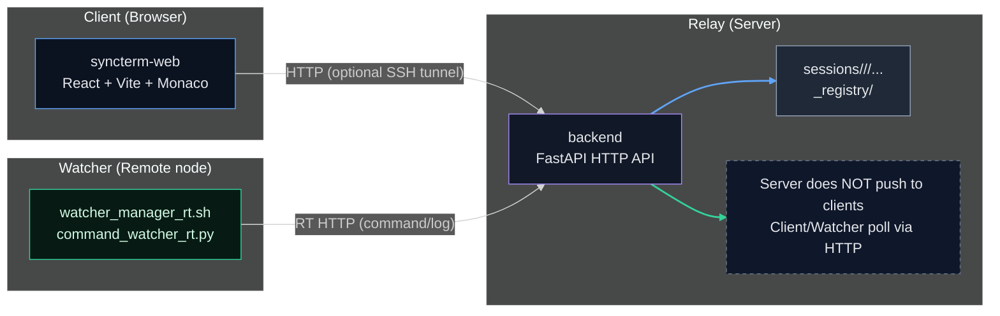

## SyncTerm‑IDE

**SyncTerm‑IDE** は、リモートマシン上のコード編集・実行・GPU 状態確認・AI エージェント操作を、ブラウザから一括で扱える「リモート開発 IDE」です。  
クライアント（ブラウザ）と Watcher（開発マシン）が別ネットワークでも、同じ Relay サーバーに到達できれば動きます。

> 🚧 **Experimental / Beta**  
> 本プロジェクトは実験段階です。仕様変更・不具合・破壊的変更の可能性があります。  
> 重要データ・本番環境ではなく **検証環境** での利用を推奨します。

### なにができるか

- リモートのコード編集・保存（ファイルツリー / マルチタブエディタ / リモートターミナル）
- GPU ノードの常時モニタリング（`nvidia-smi` / `nvitop` 風のパネル）
- コマンド実行可能な AI エージェント（Agent / Multi モード）
- SSH トンネル込みの一括起動スクリプト

より詳しい AI エージェント仕様は `docs/LOCAL-AI-AGENT-SPEC.md` を参照してください。

---

## アーキテクチャ概要（Concept）

### 全体像（スタイリッシュ版）


```mermaid
%%{init: {"theme": "dark", "flowchart": {"curve": "basis"}}}%%
flowchart LR
  classDef client fill:#0b1220,stroke:#60a5fa,color:#e5e7eb,stroke-width:1px;
  classDef relay  fill:#111827,stroke:#a78bfa,color:#e5e7eb,stroke-width:1px;
  classDef watcher fill:#071a13,stroke:#34d399,color:#d1fae5,stroke-width:1px;
  classDef store fill:#1f2937,stroke:#94a3b8,color:#e5e7eb,stroke-width:1px;
  classDef note fill:#0f172a,stroke:#64748b,color:#e5e7eb,stroke-width:1px,stroke-dasharray: 4 4;

  subgraph C["Client (Browser)"]
    WEB["syncterm-web<br/>React + Vite + Monaco"]:::client
  end

  subgraph R["Relay (Server)"]
    API["backend<br/>FastAPI HTTP API"]:::relay
    STORE["sessions/<watcher>/<session>/...<br/>_registry/"]:::store
    NOTE["Server does NOT push to clients<br/>Client/Watcher poll via HTTP"]:::note
    API --> STORE
    API --> NOTE
  end

  subgraph W["Watcher (Remote node)"]
    RT["watcher_manager_rt.sh<br/>command_watcher_rt.py"]:::watcher
  end

  WEB -->|"HTTP (optional SSH tunnel)"| API
  RT  -->|"RT HTTP (command/log)"| API

  linkStyle 0 stroke:#60a5fa,stroke-width:2px;
  linkStyle 1 stroke:#34d399,stroke-width:2px;
```

### コンポーネント

- **Client（ブラウザ）**
  - `syncterm-web/` が提供する Web UI
  - ユーザー操作 → HTTP 経由で Relay の API を叩く

- **Relay サーバー**
  - `backend/` の FastAPI アプリ
  - 役割:
    - セッションごとのファイル管理（`sessions/<watcher>/<session>/...`）
    - コマンドキュー（`commands.txt`）とログのハブ
    - AI エージェントの実行・マルチモデルディベートのオーケストレーション

- **Watcher（開発マシン / GPU ノード）**
  - `watcher_manager_rt.sh` で起動される RT Watcher
  - Relay からのコマンドを実行し、結果をログとして返す
  - GPU やファイルシステムに対する「実際の操作」を担当

### データフロー（テキストビュー）

- ブラウザ → Relay: ファイル I/O、ターミナル入力、AI アシスト要求
- Relay → Watcher: RT HTTP または `commands.txt` 経由でコマンド配送
- Watcher → Relay: コマンド結果ログ / GPU 情報 / 状態
- Relay → ブラウザ: API レスポンスとして状態を返却（サーバーからのプッシュはしない）

---

## AI 周りの機能

### チャットモード

- `ask`: 通常の質問 / 解説
- `plan`: 設計・タスク分解
- `debug`: エラーログからの原因調査
- `agent`: `<command>...</command>` を実行しながら調査・修正
- `multi`: 複数モデルによるディベート（代表エージェント + レビュワー + モデレータ）

### Agent モード

- `<command>pwd</command>` のように、安全なシェルコマンドを自動実行
- 結果は AI Chat パネルの `Logs` タブに構造化ログとして保存
- 危険コマンド（`rm -rf` など）はバックエンド側でブロックし、ユーザー承認を要求
- `pwd` / `ls` / `cat requirements.txt` のような浅い確認だけではレポートを閉じず、必要に応じて追加の実行を促す

### Multi モード（マルチモデル・ディベート）

- 代表エージェントがコマンド実行と調査を担当
- レビュワーは代表のレポートとコマンドログをレビュー
- モデレータが最終回答を 1 つに統合
- 議論の様子は `debate` タブでラウンドごとにストリーミング表示

---

## AI 設定（CPU/GPU）

`config.ini` の `[ai]` セクションで指定します（未指定時は **cpu**）。

```ini
[ai]
device = cpu  # cpu / gpu
```

---

## セットアップ（ざっくり）

```bash
cp config.ini.example config.ini
cp .env.tunnel.example .env.tunnel
./scripts/deploy_backend.sh user@relay-host
./watcher_manager_rt.sh rtx5090 "RTX 5090 Node"
./scripts/start-web-with-tunnel.sh
```

---

## ディレクトリ構成

- `syncterm-web/` — Web フロントエンド
- `backend/` — FastAPI バックエンド
- `scripts/` — デプロイ・起動スクリプト群
- `docs/` — ドキュメント

---

## ドキュメント

- セットアップ: `docs/WEB-SETUP.md`
- AI エージェント仕様: `docs/LOCAL-AI-AGENT-SPEC.md`

---

## ライセンス

MIT（`LICENSE`）
## SyncTerm‑IDE

**SyncTerm‑IDE** は、リモートマシン上のコード編集・実行・GPU 状態確認・AI エージェント操作を、ブラウザから一括で扱える「リモート開発 IDE」です。  
クライアント（ブラウザ）と Watcher（開発マシン）が別ネットワークでも、同じ Relay サーバーに到達できれば動きます。

> 🚧 **Experimental / Beta**  
> 本プロジェクトは実験段階です。仕様変更・不具合・破壊的変更の可能性があります。  
> 重要データ・本番環境ではなく **検証環境** での利用を推奨します。

### なにができるか

- リモートのコード編集・保存（ファイルツリー / マルチタブエディタ / リモートターミナル）
- GPU ノードの常時モニタリング（`nvidia-smi` / `nvitop` 風のパネル）
- コマンド実行可能な AI エージェント（Agent / Multi モード）
- SSH トンネル込みの一括起動スクリプト

より詳しい AI エージェント仕様は `docs/LOCAL-AI-AGENT-SPEC.md` を参照してください。

---

## アーキテクチャ概要（Concept）

### コンポーネント

- **Client（ブラウザ）**
  - `syncterm-web/` が提供する Web UI
  - ユーザー操作 → HTTP 経由で Relay の API を叩く

- **Relay サーバー**
  - `backend/` の FastAPI アプリ
  - 役割:
    - セッションごとのファイル管理（`sessions/<watcher>/<session>/...`）
    - コマンドキュー（`commands.txt`）とログのハブ
    - AI エージェントの実行・マルチモデルディベートのオーケストレーション

- **Watcher（開発マシン / GPU ノード）**
  - `watcher_manager_rt.sh` で起動される RT Watcher
  - Relay からのコマンドを実行し、結果をログとして返す
  - GPU やファイルシステムに対する「実際の操作」を担当

### データフロー（テキストビュー）

- ブラウザ → Relay  
  ファイル一覧・読み込み・保存、ターミナル入力（コマンド実行）、AI アシスト要求など

- Relay → Watcher  
  RT HTTP または `commands.txt` 経由で実行コマンドを送信

- Watcher → Relay  
  コマンド結果ログ / GPU 情報 / ファイル状態を返却

- Relay → ブラウザ  
  API レスポンスとしてログ・状態・AI 出力を返す（サーバーからのプッシュはしない）

この構成により、ブラウザ ↔ Relay ↔ Watcher を疎結合に保ちつつ、ファイル・コマンド・AI を一箇所で扱えるようにしています。

---

## AI 周りの機能

### チャットモード

- `ask`: 通常の質問 / 解説
- `plan`: 設計・タスク分解
- `debug`: エラーログからの原因調査
- `agent`: 実際に `<command>...</command>` を実行しながら調査・修正
- `multi`: 複数モデルによるディベート（代表エージェント + レビュワー + モデレータ）

### Agent モード

- `<command>pwd</command>` のように、安全なシェルコマンドを自動実行
- 結果は AI Chat パネルの `Logs` タブに構造化ログとして保存
- 危険コマンド（`rm -rf` など）はバックエンド側でブロックし、ユーザー承認を要求
- `pwd` / `ls` / `cat requirements.txt` のような浅い確認だけではレポートを閉じず、  
  必要に応じて `demo.py` 実行・import テスト・`pip install` などを促す

### Multi モード（マルチモデル・ディベート）

- 代表エージェントがコマンド実行と調査を担当
- レビュワーは代表のレポートとコマンドログをレビュー
- モデレータが最終回答を 1 つに統合
- 議論の様子は `debate` タブでラウンドごとにストリーミング表示
- 出力は JSON → プレーンテキストに正規化され、記事調になりすぎないよう制御

---

## AI 設定（CPU/GPU, VRAM など）

`config.ini` の `[ai]` セクションで、AI 実行環境を調整できます。

```ini
[ai]
# 使用プロバイダ: ollama または openai
ai_provider = ollama
ollama_base_url = http://127.0.0.1:11434
ollama_model = qwen2.5-coder:7b

# モデルを載せるデバイス: cpu / gpu（未指定時は cpu）
device = cpu

# 利用可能な VRAM (GB)。モデルルーティングのヒントとして使用（任意）。
vram_gb = 24
```

- `device = cpu` の場合、Ollama 呼び出し時に `options.num_gpu=0` を指定し CPU 実行を強制
- `device = gpu` の場合は GPU 実行（Ollama 側のデフォルト設定に従う）
- `vram_gb` は、利用可能 VRAM に応じたモデル選択ロジックのヒントとして使用

---

## セットアップ（ざっくり）

詳細版は `docs/WEB-SETUP.md` を参照してください。ここでは最低限だけ示します。

### 1. 設定ファイルを作る

```bash
cp config.ini.example config.ini
cp .env.tunnel.example .env.tunnel
```

- `config.ini`
  - `[remote] server = user@relay-host` を自分の環境に合わせる
  - `[ai]` に上記の AI 設定を追記する
- `.env.tunnel`
  - `TUNNEL_SSH=user@relay-host` を設定する

### 2. Relay にバックエンドをデプロイ

```bash
./scripts/deploy_backend.sh user@relay-host
```

必要なら第2引数でリモートディレクトリやポートを指定できます。

### 3. Watcher を起動（RT モード）

```bash
chmod +x watcher_manager_rt.sh
./watcher_manager_rt.sh rtx5090 "RTX 5090 Node"
```

### 4. ローカルで Web フロントの起動

```bash
cd syncterm-web
npm install
cd ..
./scripts/start-web-with-tunnel.sh
```

または:

```bash
cd syncterm-web
npm run dev:tunnel
```

### 5. ブラウザでアクセス

- ターミナルに出ている URL（例: `http://localhost:5173`）を開く
- Watcher と Session を選択し、`Files / Editor / Terminal / AI Chat / GPU` を使う

より細かい手順やトラブルシュートは `docs/WEB-SETUP.md` を参照してください。

---

## ディレクトリ構成

- `syncterm-web/` — Web フロントエンド
- `backend/` — FastAPI バックエンド
- `scripts/` — デプロイ・RT Watcher 用スクリプト群
- `watcher_manager_rt.sh` — RT Watcher 起動スクリプト
- `config.ini` — 共通設定
- `docs/` — 各種セットアップ・ガイド・AI エージェント仕様
- `desktop_legacy/` — 廃止済みデスクトップ版（参照用）

---

## ドキュメントリンク

- セットアップ: `docs/WEB-SETUP.md`
- SSH キー設定: `docs/SSH-SETUP.md`
- 操作ガイド: `docs/USAGE.md`
- トラブルシュート: `docs/TROUBLESHOOTING.md`
- AI エージェント仕様: `docs/LOCAL-AI-AGENT-SPEC.md`
- 変更履歴: `CHANGELOG.md`

---

## ライセンス

MIT  
詳細は `LICENSE` を参照してください。
## SyncTerm‑IDE

**SyncTerm‑IDE** は、リモートマシン上のコード編集・実行・GPU 状態確認・AI エージェント操作を、ブラウザから一括で扱える「リモート開発 IDE」です。  
クライアント（ブラウザ）と Watcher（開発マシン）が別ネットワークでも、同じ Relay サーバーに到達できれば動きます。

> 🚧 **Experimental / Beta**  
> 本プロジェクトは実験段階です。仕様変更・不具合・破壊的変更の可能性があります。  
> 重要データ・本番環境ではなく **検証環境** での利用を推奨します。

### なにができるか

- リモートのコード編集・保存（ファイルツリー / マルチタブエディタ / リモートターミナル）
- GPU ノードの常時モニタリング（`nvidia-smi` / `nvitop` 風のパネル）
- コマンド実行可能な AI エージェント（Agent / Multi モード）
- SSH トンネル込みの一括起動スクリプト

より詳しい AI エージェント仕様は `docs/LOCAL-AI-AGENT-SPEC.md` を参照してください。

---

## アーキテクチャ概要（Concept）

### コンポーネント

- **Client（ブラウザ）**
  - `syncterm-web/` が提供する Web UI
  - ユーザー操作 → HTTP 経由で Relay の API を叩く

- **Relay サーバー**
  - `backend/` の FastAPI アプリ
  - 役割:
    - セッションごとのファイル管理（`sessions/<watcher>/<session>/...`）
    - コマンドキュー（`commands.txt`）とログのハブ
    - AI エージェントの実行・マルチモデルディベートのオーケストレーション

- **Watcher（開発マシン / GPU ノード）**
  - `watcher_manager_rt.sh` で起動される RT Watcher
  - Relay からのコマンドを実行し、結果をログとして返す
  - GPU やファイルシステムに対する「実際の操作」を担当

### データフロー（テキストビュー）

- ブラウザ → Relay  
  ファイル一覧・読み込み・保存、ターミナル入力（コマンド実行）、AI アシスト要求など

- Relay → Watcher  
  RT HTTP または `commands.txt` 経由で実行コマンドを送信

- Watcher → Relay  
  コマンド結果ログ / GPU 情報 / ファイル状態を返却

- Relay → ブラウザ  
  API レスポンスとしてログ・状態・AI 出力を返す（サーバーからのプッシュはしない）

この構成により、ブラウザ ↔ Relay ↔ Watcher を疎結合に保ちつつ、ファイル・コマンド・AI を一箇所で扱えるようにしています。

---

## AI 周りの機能

### チャットモード

- `ask`: 通常の質問 / 解説
- `plan`: 設計・タスク分解
- `debug`: エラーログからの原因調査
- `agent`: 実際に `<command>...</command>` を実行しながら調査・修正
- `multi`: 複数モデルによるディベート（代表エージェント + レビュワー + モデレータ）

### Agent モード

- `<command>pwd</command>` のように、安全なシェルコマンドを自動実行
- 結果は AI Chat パネルの `Logs` タブに構造化ログとして保存
- 危険コマンド（`rm -rf` など）はバックエンド側でブロックし、ユーザー承認を要求
- `pwd` / `ls` / `cat requirements.txt` のような浅い確認だけではレポートを閉じず、  
  必要に応じて `demo.py` 実行・import テスト・`pip install` などを促す

### Multi モード（マルチモデル・ディベート）

- 代表エージェントがコマンド実行と調査を担当
- レビュワーは代表のレポートとコマンドログをレビュー
- モデレータが最終回答を 1 つに統合
- 議論の様子は `debate` タブでラウンドごとにストリーミング表示
- 出力は JSON → プレーンテキストに正規化され、記事調になりすぎないよう制御

---

## AI 設定（CPU/GPU, VRAM など）

`config.ini` の `[ai]` セクションで、AI 実行環境を調整できます。

```ini
[ai]
# 使用プロバイダ: ollama または openai
ai_provider = ollama
ollama_base_url = http://127.0.0.1:11434
ollama_model = qwen2.5-coder:7b

# モデルを載せるデバイス: cpu / gpu（未指定時は cpu）
device = cpu

# 利用可能な VRAM (GB)。モデルルーティングのヒントとして使用（任意）。
vram_gb = 24
```

- `device = cpu` の場合、Ollama 呼び出し時に `options.num_gpu=0` を指定し CPU 実行を強制
- `device = gpu` の場合は GPU 実行（Ollama 側のデフォルト設定に従う）
- `vram_gb` は、利用可能 VRAM に応じたモデル選択ロジックのヒントとして使用

---

## セットアップ（ざっくり）

詳細版は `docs/WEB-SETUP.md` を参照してください。ここでは最低限だけ示します。

### 1. 設定ファイルを作る

```bash
cp config.ini.example config.ini
cp .env.tunnel.example .env.tunnel
```

- `config.ini`
  - `[remote] server = user@relay-host` を自分の環境に合わせる
  - `[ai]` に上記の AI 設定を追記する
- `.env.tunnel`
  - `TUNNEL_SSH=user@relay-host` を設定する

### 2. Relay にバックエンドをデプロイ

```bash
./scripts/deploy_backend.sh user@relay-host
```

必要なら第2引数でリモートディレクトリやポートを指定できます。

### 3. Watcher を起動（RT モード）

```bash
chmod +x watcher_manager_rt.sh
./watcher_manager_rt.sh rtx5090 "RTX 5090 Node"
```

### 4. ローカルで Web フロントの起動

```bash
cd syncterm-web
npm install
cd ..
./scripts/start-web-with-tunnel.sh
```

または:

```bash
cd syncterm-web
npm run dev:tunnel
```

### 5. ブラウザでアクセス

- ターミナルに出ている URL（例: `http://localhost:5173`）を開く
- Watcher と Session を選択し、`Files / Editor / Terminal / AI Chat / GPU` を使う

より細かい手順やトラブルシュートは `docs/WEB-SETUP.md` を参照してください。

---

## ディレクトリ構成

- `syncterm-web/` — Web フロントエンド
- `backend/` — FastAPI バックエンド
- `scripts/` — デプロイ・RT Watcher 用スクリプト群
- `watcher_manager_rt.sh` — RT Watcher 起動スクリプト
- `config.ini` — 共通設定
- `docs/` — 各種セットアップ・ガイド・AI エージェント仕様
- `desktop_legacy/` — 廃止済みデスクトップ版（参照用）

---

## ドキュメントリンク

- セットアップ: `docs/WEB-SETUP.md`
- SSH キー設定: `docs/SSH-SETUP.md`
- 操作ガイド: `docs/USAGE.md`
- トラブルシュート: `docs/TROUBLESHOOTING.md`
- AI エージェント仕様: `docs/LOCAL-AI-AGENT-SPEC.md`
- 変更履歴: `CHANGELOG.md`

---

## ライセンス

MIT  
詳細は `LICENSE` を参照してください。
## SyncTerm‑IDE

**SyncTerm‑IDE** は、リモートマシン上のコード編集・実行・GPU 状態確認・AI エージェント操作を、ブラウザから一括で扱える「リモート開発 IDE」です。  
クライアント（ブラウザ）と Watcher（開発マシン）が別ネットワークでも、同じ Relay サーバーに到達できれば動きます。

> 🚧 **Experimental / Beta**  
> 本プロジェクトは実験段階です。仕様変更・不具合・破壊的変更の可能性があります。  
> 重要データ・本番環境ではなく **検証環境** での利用を推奨します。

### なにができるか

- リモートのコード編集・保存（ファイルツリー / マルチタブエディタ / リモートターミナル）
- GPU ノードの常時モニタリング（`nvidia-smi` / `nvitop` 風のパネル）
- コマンド実行可能な AI エージェント（Agent / Multi モード）
- SSH トンネル込みの一括起動スクリプト

より詳しい AI エージェント仕様は `docs/LOCAL-AI-AGENT-SPEC.md` を参照してください。

---

## アーキテクチャ概要（Concept）

### コンポーネント

- **Client（ブラウザ）**
  - `syncterm-web/` が提供する Web UI
  - ユーザー操作 → HTTP 経由で Relay の API を叩く

- **Relay サーバー**
  - `backend/` の FastAPI アプリ
  - 役割:
    - セッションごとのファイル管理（`sessions/<watcher>/<session>/...`）
    - コマンドキュー（`commands.txt`）とログのハブ
    - AI エージェントの実行・マルチモデルディベートのオーケストレーション

- **Watcher（開発マシン / GPU ノード）**
  - `watcher_manager_rt.sh` で起動される RT Watcher
  - Relay からのコマンドを実行し、結果をログとして返す
  - GPU やファイルシステムに対する「実際の操作」を担当

### データフロー（テキストビュー）

- ブラウザ → Relay  
  ファイル一覧・読み込み・保存、ターミナル入力（コマンド実行）、AI アシスト要求など

- Relay → Watcher  
  RT HTTP または `commands.txt` 経由で実行コマンドを送信

- Watcher → Relay  
  コマンド結果ログ / GPU 情報 / ファイル状態を返却

- Relay → ブラウザ  
  API レスポンスとしてログ・状態・AI 出力を返す（サーバーからのプッシュはしない）

この構成により、ブラウザ ↔ Relay ↔ Watcher を疎結合に保ちつつ、ファイル・コマンド・AI を一箇所で扱えるようにしています。

---

## AI 周りの機能

### チャットモード

- `ask`: 通常の質問 / 解説
- `plan`: 設計・タスク分解
- `debug`: エラーログからの原因調査
- `agent`: 実際に `<command>...</command>` を実行しながら調査・修正
- `multi`: 複数モデルによるディベート（代表エージェント + レビュワー + モデレータ）

### Agent モード

- `<command>pwd</command>` のように、安全なシェルコマンドを自動実行
- 結果は AI Chat パネルの `Logs` タブに構造化ログとして保存
- 危険コマンド（`rm -rf` など）はバックエンド側でブロックし、ユーザー承認を要求
- `pwd` / `ls` / `cat requirements.txt` のような浅い確認だけではレポートを閉じず、  
  必要に応じて `demo.py` 実行・import テスト・`pip install` などを促す

### Multi モード（マルチモデル・ディベート）

- 代表エージェントがコマンド実行と調査を担当
- レビュワーは代表のレポートとコマンドログをレビュー
- モデレータが最終回答を 1 つに統合
- 議論の様子は `debate` タブでラウンドごとにストリーミング表示
- 出力は JSON → プレーンテキストに正規化され、記事調になりすぎないよう制御

---

## AI 設定（CPU/GPU, VRAM など）

`config.ini` の `[ai]` セクションで、AI 実行環境を調整できます。

```ini
[ai]
# 使用プロバイダ: ollama または openai
ai_provider = ollama
ollama_base_url = http://127.0.0.1:11434
ollama_model = qwen2.5-coder:7b

# モデルを載せるデバイス: cpu / gpu（未指定時は cpu）
device = cpu

# 利用可能な VRAM (GB)。モデルルーティングのヒントとして使用（任意）。
vram_gb = 24
```

- `device = cpu` の場合、Ollama 呼び出し時に `options.num_gpu=0` を指定し CPU 実行を強制
- `device = gpu` の場合は GPU 実行（Ollama 側のデフォルト設定に従う）
- `vram_gb` は、利用可能 VRAM に応じたモデル選択ロジックのヒントとして使用

---

## セットアップ（ざっくり）

詳細版は `docs/WEB-SETUP.md` を参照してください。ここでは最低限だけ示します。

### 1. 設定ファイルを作る

```bash
cp config.ini.example config.ini
cp .env.tunnel.example .env.tunnel
```

- `config.ini`
  - `[remote] server = user@relay-host` を自分の環境に合わせる
  - `[ai]` に上記の AI 設定を追記する
- `.env.tunnel`
  - `TUNNEL_SSH=user@relay-host` を設定する

### 2. Relay にバックエンドをデプロイ

```bash
./scripts/deploy_backend.sh user@relay-host
```

必要なら第2引数でリモートディレクトリやポートを指定できます。

### 3. Watcher を起動（RT モード）

```bash
chmod +x watcher_manager_rt.sh
./watcher_manager_rt.sh rtx5090 "RTX 5090 Node"
```

### 4. ローカルで Web フロントの起動

```bash
cd syncterm-web
npm install
cd ..
./scripts/start-web-with-tunnel.sh
```

または:

```bash
cd syncterm-web
npm run dev:tunnel
```

### 5. ブラウザでアクセス

- ターミナルに出ている URL（例: `http://localhost:5173`）を開く
- Watcher と Session を選択し、`Files / Editor / Terminal / AI Chat / GPU` を使う

より細かい手順やトラブルシュートは `docs/WEB-SETUP.md` を参照してください。

---

## ディレクトリ構成

- `syncterm-web/` — Web フロントエンド
- `backend/` — FastAPI バックエンド
- `scripts/` — デプロイ・RT Watcher 用スクリプト群
- `watcher_manager_rt.sh` — RT Watcher 起動スクリプト
- `config.ini` — 共通設定
- `docs/` — 各種セットアップ・ガイド・AI エージェント仕様
- `desktop_legacy/` — 廃止済みデスクトップ版（参照用）

---

## ドキュメントリンク

- セットアップ: `docs/WEB-SETUP.md`
- SSH キー設定: `docs/SSH-SETUP.md`
- 操作ガイド: `docs/USAGE.md`
- トラブルシュート: `docs/TROUBLESHOOTING.md`
- AI エージェント仕様: `docs/LOCAL-AI-AGENT-SPEC.md`
- 変更履歴: `CHANGELOG.md`

---

## ライセンス

MIT  
詳細は `LICENSE` を参照してください。
## SyncTerm‑IDE

**SyncTerm‑IDE** は、リモートマシン上のコード編集・実行・GPU 状態確認・AI エージェント操作を、ブラウザから一括で扱える「リモート開発 IDE」です。  
クライアント（ブラウザ）と Watcher（開発マシン）が別ネットワークでも、同じ Relay サーバーに到達できれば動きます。

> 🚧 **Experimental / Beta**  
> 本プロジェクトは実験段階です。仕様変更・不具合・破壊的変更の可能性があります。  
> 重要データ・本番環境ではなく **検証環境** での利用を推奨します。

### なにができるか

- リモートのコード編集・保存（ファイルツリー / マルチタブエディタ / リモートターミナル）
- GPU ノードの常時モニタリング（`nvidia-smi` / `nvitop` 風のパネル）
- コマンド実行可能な AI エージェント（Agent / Multi モード）
- SSH トンネル込みの一括起動スクリプト

より詳しい AI エージェント仕様は `docs/LOCAL-AI-AGENT-SPEC.md` を参照してください。

---

## アーキテクチャ概要（Concept）

### コンポーネント

- **Client（ブラウザ）**
  - `syncterm-web/` が提供する Web UI
  - ユーザー操作 → HTTP 経由で Relay の API を叩く

- **Relay サーバー**
  - `backend/` の FastAPI アプリ
  - 役割:
    - セッションごとのファイル管理（`sessions/<watcher>/<session>/...`）
    - コマンドキュー（`commands.txt`）とログのハブ
    - AI エージェントの実行・マルチモデルディベートのオーケストレーション

- **Watcher（開発マシン / GPU ノード）**
  - `watcher_manager_rt.sh` で起動される RT Watcher
  - Relay からのコマンドを実行し、結果をログとして返す
  - GPU やファイルシステムに対する「実際の操作」を担当

### データフロー（テキストビュー）

- ブラウザ → Relay  
  ファイル一覧・読み込み・保存、ターミナル入力（コマンド実行）、AI アシスト要求など

- Relay → Watcher  
  RT HTTP または `commands.txt` 経由で実行コマンドを送信

- Watcher → Relay  
  コマンド結果ログ / GPU 情報 / ファイル状態を返却

- Relay → ブラウザ  
  API レスポンスとしてログ・状態・AI 出力を返す（サーバーからのプッシュはしない）

この構成により、ブラウザ ↔ Relay ↔ Watcher を疎結合に保ちつつ、ファイル・コマンド・AI を一箇所で扱えるようにしています。

---

## AI 周りの機能

### チャットモード

- `ask`: 通常の質問 / 解説
- `plan`: 設計・タスク分解
- `debug`: エラーログからの原因調査
- `agent`: 実際に `<command>...</command>` を実行しながら調査・修正
- `multi`: 複数モデルによるディベート（代表エージェント + レビュワー + モデレータ）

### Agent モード

- `<command>pwd</command>` のように、安全なシェルコマンドを自動実行
- 結果は AI Chat パネルの `Logs` タブに構造化ログとして保存
- 危険コマンド（`rm -rf` など）はバックエンド側でブロックし、ユーザー承認を要求
- `pwd` / `ls` / `cat requirements.txt` のような浅い確認だけではレポートを閉じず、  
  必要に応じて `demo.py` 実行・import テスト・`pip install` などを促す

### Multi モード（マルチモデル・ディベート）

- 代表エージェントがコマンド実行と調査を担当
- レビュワーは代表のレポートとコマンドログをレビュー
- モデレータが最終回答を 1 つに統合
- 議論の様子は `debate` タブでラウンドごとにストリーミング表示
- 出力は JSON → プレーンテキストに正規化され、記事調になりすぎないよう制御

---

## AI 設定（CPU/GPU, VRAM など）

`config.ini` の `[ai]` セクションで、AI 実行環境を調整できます。

```ini
[ai]
# 使用プロバイダ: ollama または openai
ai_provider = ollama
ollama_base_url = http://127.0.0.1:11434
ollama_model = qwen2.5-coder:7b

# モデルを載せるデバイス: cpu / gpu（未指定時は cpu）
device = cpu

# 利用可能な VRAM (GB)。モデルルーティングのヒントとして使用（任意）。
vram_gb = 24
```

- `device = cpu` の場合、Ollama 呼び出し時に `options.num_gpu=0` を指定し CPU 実行を強制
- `device = gpu` の場合は GPU 実行（Ollama 側のデフォルト設定に従う）
- `vram_gb` は、利用可能 VRAM に応じたモデル選択ロジックのヒントとして使用

---

## セットアップ（ざっくり）

詳細版は `docs/WEB-SETUP.md` を参照してください。ここでは最低限だけ示します。

### 1. 設定ファイルを作る

```bash
cp config.ini.example config.ini
cp .env.tunnel.example .env.tunnel
```

- `config.ini`
  - `[remote] server = user@relay-host` を自分の環境に合わせる
  - `[ai]` に上記の AI 設定を追記する
- `.env.tunnel`
  - `TUNNEL_SSH=user@relay-host` を設定する

### 2. Relay にバックエンドをデプロイ

```bash
./scripts/deploy_backend.sh user@relay-host
```

必要なら第2引数でリモートディレクトリやポートを指定できます。

### 3. Watcher を起動（RT モード）

```bash
chmod +x watcher_manager_rt.sh
./watcher_manager_rt.sh rtx5090 "RTX 5090 Node"
```

### 4. ローカルで Web フロントの起動

```bash
cd syncterm-web
npm install
cd ..
./scripts/start-web-with-tunnel.sh
```

または:

```bash
cd syncterm-web
npm run dev:tunnel
```

### 5. ブラウザでアクセス

- ターミナルに出ている URL（例: `http://localhost:5173`）を開く
- Watcher と Session を選択し、`Files / Editor / Terminal / AI Chat / GPU` を使う

より細かい手順やトラブルシュートは `docs/WEB-SETUP.md` を参照してください。

---

## ディレクトリ構成

- `syncterm-web/` — Web フロントエンド
- `backend/` — FastAPI バックエンド
- `scripts/` — デプロイ・RT Watcher 用スクリプト群
- `watcher_manager_rt.sh` — RT Watcher 起動スクリプト
- `config.ini` — 共通設定
- `docs/` — 各種セットアップ・ガイド・AI エージェント仕様
- `desktop_legacy/` — 廃止済みデスクトップ版（参照用）

---

## ドキュメントリンク

- セットアップ: `docs/WEB-SETUP.md`
- SSH キー設定: `docs/SSH-SETUP.md`
- 操作ガイド: `docs/USAGE.md`
- トラブルシュート: `docs/TROUBLESHOOTING.md`
- AI エージェント仕様: `docs/LOCAL-AI-AGENT-SPEC.md`
- 変更履歴: `CHANGELOG.md`

---

## ライセンス

MIT  
詳細は `LICENSE` を参照してください。
## SyncTerm‑IDE

**SyncTerm‑IDE** は、リモートマシン上のコード編集・実行・GPU 状態確認・AI エージェント操作を、ブラウザから一括で扱える「リモート開発 IDE」です。  
クライアント（ブラウザ）と Watcher（開発マシン）が別ネットワークでも、同じ Relay サーバーに到達できれば動きます。

> 🚧 **Experimental / Beta**  
> 本プロジェクトは実験段階です。仕様変更・不具合・破壊的変更の可能性があります。  
> 重要データ・本番環境ではなく **検証環境** での利用を推奨します。

### なにができるか

- リモートのコード編集・保存（ファイルツリー / マルチタブエディタ / リモートターミナル）
- GPU ノードの常時モニタリング（`nvidia-smi` / `nvitop` 風のパネル）
- コマンド実行可能な AI エージェント（Agent / Multi モード）
- SSH トンネル込みの一括起動スクリプト

より詳しい AI エージェント仕様は `docs/LOCAL-AI-AGENT-SPEC.md` を参照してください。

---

## アーキテクチャ概要（Concept）

### コンポーネント

- **Client（ブラウザ）**
  - `syncterm-web/` が提供する Web UI
  - ユーザー操作 → HTTP 経由で Relay の API を叩く

- **Relay サーバー**
  - `backend/` の FastAPI アプリ
  - 役割:
    - セッションごとのファイル管理（`sessions/<watcher>/<session>/...`）
    - コマンドキュー（`commands.txt`）とログのハブ
    - AI エージェントの実行・マルチモデルディベートのオーケストレーション

- **Watcher（開発マシン / GPU ノード）**
  - `watcher_manager_rt.sh` で起動される RT Watcher
  - Relay からのコマンドを実行し、結果をログとして返す
  - GPU やファイルシステムに対する「実際の操作」を担当

### データフロー（テキストビュー）

- ブラウザ → Relay  
  ファイル一覧・読み込み・保存、ターミナル入力（コマンド実行）、AI アシスト要求など

- Relay → Watcher  
  RT HTTP または `commands.txt` 経由で実行コマンドを送信

- Watcher → Relay  
  コマンド結果ログ / GPU 情報 / ファイル状態を返却

- Relay → ブラウザ  
  API レスポンスとしてログ・状態・AI 出力を返す（サーバーからのプッシュはしない）

この構成により、ブラウザ ↔ Relay ↔ Watcher を疎結合に保ちつつ、ファイル・コマンド・AI を一箇所で扱えるようにしています。

---

## AI 周りの機能

### チャットモード

- `ask`: 通常の質問 / 解説
- `plan`: 設計・タスク分解
- `debug`: エラーログからの原因調査
- `agent`: 実際に `<command>...</command>` を実行しながら調査・修正
- `multi`: 複数モデルによるディベート（代表エージェント + レビュワー + モデレータ）

### Agent モード

- `<command>pwd</command>` のように、安全なシェルコマンドを自動実行
- 結果は AI Chat パネルの `Logs` タブに構造化ログとして保存
- 危険コマンド（`rm -rf` など）はバックエンド側でブロックし、ユーザー承認を要求
- `pwd` / `ls` / `cat requirements.txt` のような浅い確認だけではレポートを閉じず、  
  必要に応じて `demo.py` 実行・import テスト・`pip install` などを促す

### Multi モード（マルチモデル・ディベート）

- 代表エージェントがコマンド実行と調査を担当
- レビュワーは代表のレポートとコマンドログをレビュー
- モデレータが最終回答を 1 つに統合
- 議論の様子は `debate` タブでラウンドごとにストリーミング表示
- 出力は JSON → プレーンテキストに正規化され、記事調になりすぎないよう制御

---

## AI 設定（CPU/GPU, VRAM など）

`config.ini` の `[ai]` セクションで、AI 実行環境を調整できます。

```ini
[ai]
# 使用プロバイダ: ollama または openai
ai_provider = ollama
ollama_base_url = http://127.0.0.1:11434
ollama_model = qwen2.5-coder:7b

# モデルを載せるデバイス: cpu / gpu（未指定時は cpu）
device = cpu

# 利用可能な VRAM (GB)。モデルルーティングのヒントとして使用（任意）。
vram_gb = 24
```

- `device = cpu` の場合、Ollama 呼び出し時に `options.num_gpu=0` を指定し CPU 実行を強制
- `device = gpu` の場合は GPU 実行（Ollama 側のデフォルト設定に従う）
- `vram_gb` は、利用可能 VRAM に応じたモデル選択ロジックのヒントとして使用

---

## セットアップ（ざっくり）

詳細版は `docs/WEB-SETUP.md` を参照してください。ここでは最低限だけ示します。

### 1. 設定ファイルを作る

```bash
cp config.ini.example config.ini
cp .env.tunnel.example .env.tunnel
```

- `config.ini`
  - `[remote] server = user@relay-host` を自分の環境に合わせる
  - `[ai]` に上記の AI 設定を追記する
- `.env.tunnel`
  - `TUNNEL_SSH=user@relay-host` を設定する

### 2. Relay にバックエンドをデプロイ

```bash
./scripts/deploy_backend.sh user@relay-host
```

必要なら第2引数でリモートディレクトリやポートを指定できます。

### 3. Watcher を起動（RT モード）

```bash
chmod +x watcher_manager_rt.sh
./watcher_manager_rt.sh rtx5090 "RTX 5090 Node"
```

### 4. ローカルで Web フロントの起動

```bash
cd syncterm-web
npm install
cd ..
./scripts/start-web-with-tunnel.sh
```

または:

```bash
cd syncterm-web
npm run dev:tunnel
```

### 5. ブラウザでアクセス

- ターミナルに出ている URL（例: `http://localhost:5173`）を開く
- Watcher と Session を選択し、`Files / Editor / Terminal / AI Chat / GPU` を使う

より細かい手順やトラブルシュートは `docs/WEB-SETUP.md` を参照してください。

---

## ディレクトリ構成

- `syncterm-web/` — Web フロントエンド
- `backend/` — FastAPI バックエンド
- `scripts/` — デプロイ・RT Watcher 用スクリプト群
- `watcher_manager_rt.sh` — RT Watcher 起動スクリプト
- `config.ini` — 共通設定
- `docs/` — 各種セットアップ・ガイド・AI エージェント仕様
- `desktop_legacy/` — 廃止済みデスクトップ版（参照用）

---

## ドキュメントリンク

- セットアップ: `docs/WEB-SETUP.md`
- SSH キー設定: `docs/SSH-SETUP.md`
- 操作ガイド: `docs/USAGE.md`
- トラブルシュート: `docs/TROUBLESHOOTING.md`
- AI エージェント仕様: `docs/LOCAL-AI-AGENT-SPEC.md`
- 変更履歴: `CHANGELOG.md`

---

## ライセンス

MIT  
詳細は `LICENSE` を参照してください。

* **セットアップ**: **[docs/WEB-SETUP.md](docs/WEB-SETUP.md)** を参照。
* **デスクトップ版（Python/Tkinter）は廃止**。過去バージョンは [desktop_legacy/](desktop_legacy/) に退避済み。

> 📣 **What's New — v4.0（大型アップデート）**: Web 版の本格対応、リバーストンネル（RT）モード、トンネル付き一括起動、Staged キャッシュ削除、画像プレビュー／画像タブ分離など。詳細は [CHANGELOG.md](CHANGELOG.md) を参照。

---

## Features

* **Web 版（React + Vite + Monaco）**: ブラウザから利用できる Web フロントエンド。SSH トンネル付き一括起動（`start-web-with-tunnel.sh` / `npm run dev:tunnel`）に対応。
* **中継サーバー方式（FastAPI バックエンド）**: クライアントと Watcher は直接接続不要。Relay 上の FastAPI バックエンドが HTTP API でファイル・ログ・コマンド・AI を仲介する（サーバーからクライアントへのプッシュは行わない）。
* **Watcher / Session ベースのリモート開発**: 複数の Watcher（開発マシン）と Session（作業単位）を切り替えながら、リモート側のファイル編集・コマンド実行を行える。
* **エディタ・ターミナル・ファイルツリー UI**: 左に Files、右にエディタ（マルチタブ）、下にターミナルという構成。大きなファイルはチャンク読み込みで扱い、保存時は Relay 経由で Watcher に反映される。
* **画像プレビュー・GPU ステータス・プレビュータブ**: 対応画像を Blob 取得でプレビュー表示し、専用タブとしてエディタと分離。Watcher 側の `nvidia-smi` 出力を Web 上の GPU パネルで確認できる。
* **AI アシスト & インライン補完（任意）**: Relay 上のバックエンドから AI 補完・チャットを呼び出す。Ollama（Relay 上）または OpenAI / ローカル AI プロキシ経由で、エディタの選択範囲やファイル全体をもとにリファクタ・説明・プランニングなどを行う。
* **Preferences（設定）とレイアウト調整**: テーマ・フォント・行間・ミニマップ・ターミナルポーリング間隔・GPU/AI パネル表示有無などをブラウザ側に保存し、ドラッグ操作で各ペインの幅や高さを調整できる。

---

## Architecture (Concept)


```mermaid
%%{init: {"theme": "dark"}}%%
flowchart LR
  subgraph A["PC A (Client)"]
    WEB["Browser<br/>syncterm-web"]
  end

  subgraph S["Server (Relay only)"]
    STORE["app_root/sessions<br/>app_root/_registry"]
    NOTE["No push to local<br/>(HTTP API)"]
  end

  subgraph B["PC B (Watcher 1)"]
    W1["watcher_manager_rt.sh<br/>↳ command_watcher_rt.py"]
  end

  subgraph C["PC C (Watcher 2)"]
    W2["watcher_manager_rt.sh<br/>↳ command_watcher_rt.py"]
  end

  WEB -->|HTTP / tunnel| S
  W1  -->|RT: HTTP| S
  W2  -->|RT: HTTP| S

  classDef local   fill:#1f2937,stroke:#60a5fa,color:#e5e7eb;
  classDef watcher fill:#0f172a,stroke:#34d399,color:#d1fae5;
  classDef storage fill:#312e81,stroke:#a78bfa,color:#ede9fe;
  classDef note    fill:#374151,stroke:#6b7280,color:#e5e7eb;

  class WEB local
  class W1,W2 watcher
  class STORE storage
  class NOTE note

  style A fill:#111827,stroke:#374151,stroke-width:1px
  style B fill:#111827,stroke:#374151,stroke-width:1px
  style C fill:#111827,stroke:#374151,stroke-width:1px
  style S fill:#111827,stroke:#374151,stroke-width:1px

  linkStyle default stroke:#60a5fa,stroke-width:2px
```

> **ポイント**
>
> * 矢印は **クライアント／Watcher → サーバー** の向きのみ（サーバーはプッシュしない）。
> * ブラウザは Relay の HTTP API でログ取得・コマンド送信・ファイル編集を行う。
> * Watcher は RT モードで Relay へ HTTP によりログ・状態を送受信する。

---

## Quick Start

**前提**: 中継サーバー（Relay）および Watcher を動かすマシンへ SSH 接続可能であること。SSH 鍵の設定は [docs/SSH-SETUP.md](docs/SSH-SETUP.md) を参照。

#### 1. 設定ファイルの用意

```bash
cp config.ini.example config.ini
cp .env.tunnel.example .env.tunnel
```

- `config.ini`: `[remote]` の `server` を環境に合わせて編集する。アプリルートは通常 `~/SyncTerm-IDE`（base_path は廃止）。
- `.env.tunnel`: `TUNNEL_SSH` を `user@relay-host` の形式で編集する（ローカルから Relay へ SSH トンネルを張るための指定）。

**トンネルで起動する場合**: `syncterm-web/.env.local` を作成し、`VITE_BACKEND_URL=http://localhost:8002` を書く。既定は 8000 のため、トンネル（8002）を使うなら必須。

#### 2. 中継サーバー（Relay）でバックエンドを起動する

Relay 上でリポジトリを配置したうえで、デプロイスクリプトを実行する。

```bash
./scripts/deploy_backend.sh user@relay-host
```

別のリモートディレクトリを使う場合: 第2引数で指定する（`./scripts/deploy_backend.sh user@relay-host /path/to/remote/dir 8000`）。または `config.ini` の `[remote]` に `deploy_dir = ~/mnt` を書くと、第2引数省略時にそのパスが使われる。

#### 3. Watcher を RT 版で起動する

Watcher を動かすマシンで、リバーストンネル版を使用する。

```bash
chmod +x watcher_manager_rt.sh
./watcher_manager_rt.sh <watcher_id> "Display Name"
```

例: `./watcher_manager_rt.sh pc-b "PC B"`  
`config.ini` に `[rt]` セクション（`rt_port`, `backend_port`, `relay_local_port`）が含まれていることを確認する。

#### 4. ローカルで Web フロントを起動する

```bash
cd syncterm-web
npm install
cd ..
cp .env.tunnel.example .env.tunnel   # 未作成なら。TUNNEL_SSH を編集済みであること
./scripts/start-web-with-tunnel.sh
```

または `syncterm-web` から `npm run dev:tunnel` を実行してもよい。トンネル（localhost:8002 → Relay:8000）が張られたうえで Vite が起動する。

**別 PC で開く場合やトンネルを使わない場合**: `syncterm-web/.env.local` を作成し、バックエンドの URL を指定する。トンネル経由なら `VITE_BACKEND_URL=http://localhost:8002`、Relay に直接アクセスするなら `VITE_BACKEND_URL=http://<Relayのホスト>:8000`。未設定時は `http://localhost:8000` が使われる。

#### 5. ブラウザでアクセスする

ターミナルに表示された URL（例: `http://localhost:5173`）をブラウザで開く。Watcher と Session を選択し、Files / Editor / Terminal を利用する。

---

より詳しい手順（バックエンドの手動起動、AI プロキシ、トラブルシュート）は **[docs/WEB-SETUP.md](docs/WEB-SETUP.md)** を参照。

---

## Files（ルート構成）

* `syncterm-web/` — Web フロントエンド（React + Vite）
* `backend/` — Relay 用 FastAPI バックエンド
* `scripts/` — デプロイ・Watcher RT 用スクリプト（`command_watcher_rt.py` 含む）
* `watcher_manager_rt.sh` — Watcher 起動（RT モード）
* `config.ini` — 共通設定（Relay / Watcher で使用）
* `desktop_legacy/` — **廃止したデスクトップ版の退避先**（参照用）

---

## Docs

* **セットアップ**: [docs/WEB-SETUP.md](docs/WEB-SETUP.md)
* **SSH キー設定**: [docs/SSH-SETUP.md](docs/SSH-SETUP.md)
* **操作ガイド**: [docs/USAGE.md](docs/USAGE.md)
* **トラブルシュート**: [docs/TROUBLESHOOTING.md](docs/TROUBLESHOOTING.md)
* **Changelog**: [CHANGELOG.md](CHANGELOG.md)
* **廃止デスクトップ版**: [desktop_legacy/README.md](desktop_legacy/README.md)

> まずは SSH キー手順（`ssh-keygen -t ed25519` → 公開鍵をサーバーの `~/.ssh/authorized_keys` へ）を完了してください。詳細は **SSH-SETUP.md** に記載。

---

## Changelog

詳しくは [CHANGELOG.md](CHANGELOG.md) を参照。

* **ver.5.x — AI エージェント / AI チャット**: エディタと連携する AI エージェント（`agent` / `plan` / `debug` / `ask` モード）、思考レベル（`quick` / `balanced` / `deep`）、セッションごとの AI チャットタブ、モデル自動準備（ensure）機能、インライン補完との統合など。
* **ver.4.x — Web 版本格対応 / RT モード**: Web フロント（React + Vite）と FastAPI バックエンド、リバーストンネル（RT）モード、トンネル付き一括起動、Staged キャッシュ削除、画像プレビュー／プレビュータブ／GPU パネルなど。
* **ver.3.x — Docker 統合 / リアルタイムログ**: Docker 実行モードの追加、ログ逐次同期、Python 実行ボタン、シンボリックリンク対応強化など。
* **ver.2.x — リンク編集 / Preferences**: Watcher フォルダのリンク編集、Preferences（フォント・テーマ等）、レジストリ同期改善、エディタの横スクロールや検索マーカー強化など。
* **ver.1.x — 初期デスクトップ版**: Python/Tkinter ベースの初期 GUI と基本的な Watcher 連携。

---

## ⚠️ 注意事項

* **信頼境界と権限**
  * 通信は **クライアント発** に限る。Web 版は HTTP（必要に応じて SSH トンネル）、Watcher は RT モードで HTTP、従来モードで rsync/SSH。**サーバーからクライアントへはプッシュしない。**
  * サーバー上のアプリルート（例: ~/SyncTerm-IDE）は専用ユーザ・厳しめのパーミッションで運用すること。第三者が `commands.txt` 等を書きに来られる構成は危険である。

* **ログ・リアルタイム性**
  * **RT モード**: Watcher が Relay へ HTTP でコマンド・ログを送受信するため、遅延は小さい。
  * **ターミナル**: Remote モードは Watcher 上で実行。Local モードはコマンド実行なし（表示のみ）。

## License

MIT
