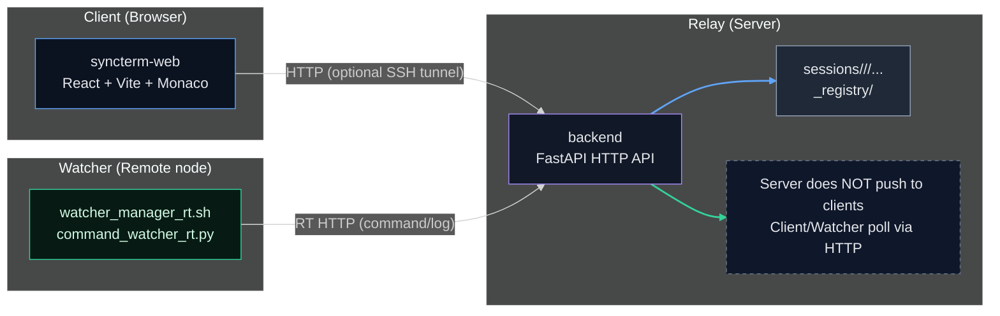

## SyncTerm‑IDE

**SyncTerm‑IDE** は、リモートマシン上のコード編集・実行・GPU 状態確認・AI エージェント操作を、ブラウザから一括で扱える「リモート開発 IDE」です。  
クライアント（ブラウザ）と Watcher（開発マシン）が別ネットワークでも、同じ Relay サーバーに到達できれば動きます。

> 🚧 **Experimental / Beta**  
> 本プロジェクトは実験段階です。仕様変更・不具合・破壊的変更の可能性があります。  
> 重要データ・本番環境ではなく **検証環境** での利用を推奨します。

### なにができるか

- リモートのコード編集・保存（ファイルツリー / マルチタブエディタ / リモートターミナル）
- GPU ノードの常時モニタリング（`nvidia-smi` / `nvitop` 風のパネル）
- コマンド実行可能な AI エージェント（Agent / Multi モード）
- SSH トンネル込みの一括起動スクリプト

より詳しい AI エージェント仕様は `docs/LOCAL-AI-AGENT-SPEC.md` を参照してください。

---

## アーキテクチャ概要（Concept）

### 全体像（スタイリッシュ版）


```mermaid
%%{init: {"theme": "dark", "flowchart": {"curve": "basis"}}}%%
flowchart LR
  classDef client fill:#0b1220,stroke:#60a5fa,color:#e5e7eb,stroke-width:1px;
  classDef relay  fill:#111827,stroke:#a78bfa,color:#e5e7eb,stroke-width:1px;
  classDef watcher fill:#071a13,stroke:#34d399,color:#d1fae5,stroke-width:1px;
  classDef store fill:#1f2937,stroke:#94a3b8,color:#e5e7eb,stroke-width:1px;
  classDef note fill:#0f172a,stroke:#64748b,color:#e5e7eb,stroke-width:1px,stroke-dasharray: 4 4;

  subgraph C["Client (Browser)"]
    WEB["syncterm-web<br/>React + Vite + Monaco"]:::client
  end

  subgraph R["Relay (Server)"]
    API["backend<br/>FastAPI HTTP API"]:::relay
    STORE["sessions/<watcher>/<session>/...<br/>_registry/"]:::store
    NOTE["Server does NOT push to clients<br/>Client/Watcher poll via HTTP"]:::note
    API --> STORE
    API --> NOTE
  end

  subgraph W["Watcher (Remote node)"]
    RT["watcher_manager_rt.sh<br/>command_watcher_rt.py"]:::watcher
  end

  WEB -->|"HTTP (optional SSH tunnel)"| API
  RT  -->|"RT HTTP (command/log)"| API

  linkStyle 0 stroke:#60a5fa,stroke-width:2px;
  linkStyle 1 stroke:#34d399,stroke-width:2px;
```

### コンポーネント

- **Client（ブラウザ）**
  - `syncterm-web/` が提供する Web UI
  - ユーザー操作 → HTTP 経由で Relay の API を叩く

- **Relay サーバー**
  - `backend/` の FastAPI アプリ
  - 役割:
    - セッションごとのファイル管理（`sessions/<watcher>/<session>/...`）
    - コマンドキュー（`commands.txt`）とログのハブ
    - AI エージェントの実行・マルチモデルディベートのオーケストレーション

- **Watcher（開発マシン / GPU ノード）**
  - `watcher_manager_rt.sh` で起動される RT Watcher
  - Relay からのコマンドを実行し、結果をログとして返す
  - GPU やファイルシステムに対する「実際の操作」を担当

### データフロー（テキストビュー）

- ブラウザ → Relay: ファイル I/O、ターミナル入力、AI アシスト要求
- Relay → Watcher: RT HTTP または `commands.txt` 経由でコマンド配送
- Watcher → Relay: コマンド結果ログ / GPU 情報 / 状態
- Relay → ブラウザ: API レスポンスとして状態を返却（サーバーからのプッシュはしない）

---

## AI 周りの機能

### チャットモード

- `ask`: 通常の質問 / 解説
- `plan`: 設計・タスク分解
- `debug`: エラーログからの原因調査
- `agent`: `<command>...</command>` を実行しながら調査・修正
- `multi`: 複数モデルによるディベート（代表エージェント + レビュワー + モデレータ）

### Agent モード

- `<command>pwd</command>` のように、安全なシェルコマンドを自動実行
- 結果は AI Chat パネルの `Logs` タブに構造化ログとして保存
- 危険コマンド（`rm -rf` など）はバックエンド側でブロックし、ユーザー承認を要求
- `pwd` / `ls` / `cat requirements.txt` のような浅い確認だけではレポートを閉じず、必要に応じて追加の実行を促す

### Multi モード（マルチモデル・ディベート）

- 代表エージェントがコマンド実行と調査を担当
- レビュワーは代表のレポートとコマンドログをレビュー
- モデレータが最終回答を 1 つに統合
- 議論の様子は `debate` タブでラウンドごとにストリーミング表示

---

## AI 設定（CPU/GPU）

`config.ini` の `[ai]` セクションで指定します（未指定時は **cpu**）。

```ini
[ai]
device = cpu  # cpu / gpu
```

---

## セットアップ（ざっくり）

```bash
cp config.ini.example config.ini
cp .env.tunnel.example .env.tunnel
./scripts/deploy_backend.sh user@relay-host
./watcher_manager_rt.sh rtx5090 "RTX 5090 Node"
./scripts/start-web-with-tunnel.sh
```

---

## ディレクトリ構成

- `syncterm-web/` — Web フロントエンド
- `backend/` — FastAPI バックエンド
- `scripts/` — デプロイ・起動スクリプト群
- `docs/` — ドキュメント

---

## ドキュメント

- セットアップ: `docs/WEB-SETUP.md`
- AI エージェント仕様: `docs/LOCAL-AI-AGENT-SPEC.md`

---

## ライセンス

MIT（`LICENSE`）
