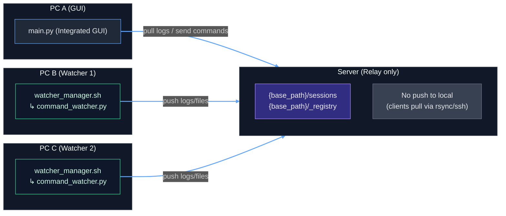

# SyncTerm-IDE

> 🚧 **Experimental / Beta**: 本プロジェクトは**実験段階のプロトタイプ**です。動作が不安定になることがあります。仕様は予告なく変更される可能性があります。重要データ・本番環境での利用は避け、検証環境でお試しください。

*A lightweight multi‑tab editor + terminal for remote development with a neutral relay server*

SyncTerm‑IDE は、**クライアント（Web ブラウザまたはデスクトップ GUI）** と **Watcher（PC B/C, …）** が別ネットワークにあっても、両者が **同じ中継サーバー（Relay）へ接続可能であれば制御できる** 軽量リモート開発環境である。サーバーは **中継専用（クライアントへプッシュしない）**。通信は **クライアント発** で、Web 版では **HTTP**（必要に応じて SSH トンネル）、Watcher は **リバーストンネル（RT）モード** で HTTP による即時送受信、従来モードでは **rsync / SSH** により行う。

---

## 推奨: Web 版

**新規利用・通常利用は Web 版を推奨します。**

| 項目 | Web 版 | デスクトップ版（Python GUI） |
|------|--------|-----------------------------|
| 起動 | ブラウザ + 1 コマンド（トンネル付き一括起動あり） | Python 依存・ローカル実行 |
| 環境 | Node.js + ブラウザ | Python + Tkinter 等 |
| リバーストンネル | 対応（低遅延・即時反映） | 非対応（rsync ポーリング） |

* Web 版のセットアップ: **[docs/WEB-SETUP.md](docs/WEB-SETUP.md)** を参照。
* デスクトップ版は従来どおり **Quick Start（下記）** および [docs/SETUP.md](docs/SETUP.md) を参照。

> 📣 **What's New — v4.0（大型アップデート）**: Web 版の本格対応、リバーストンネル（RT）モード、トンネル付き一括起動、Staged キャッシュ削除、画像プレビュー／画像タブ分離など。詳細は [CHANGELOG.md](CHANGELOG.md) を参照。

---

## Features

* **Web 版**: ブラウザで利用。トンネル付き一括起動。RT モードでコマンド・ログを HTTP 即時送受信。
* **中継サーバー方式**: クライアントと Watcher は直接接続不要。サーバーは中継のみ（クライアントへプッシュしない）。
* **エディタ・ターミナル・ファイルツリー**: Watcher 上でリモート実行・編集。複数 Watcher を切り替え可能。
* **画像プレビュー**: 対応画像をプレビュー表示。リモートフォルダをシンボリックリンクでセッションに追加可能。

---

## Architecture (Concept)


```mermaid
%%{init: {"theme": "dark"}}%%
flowchart LR
  subgraph A["PC A (GUI)"]
    GUI["main.py (Integrated GUI)"]
  end

  subgraph S["Server (Relay only)"]
    STORE["{base_path}/sessions<br/>{base_path}/_registry"]
    NOTE["No push to local<br/>(clients pull via rsync/ssh)"]
  end

  subgraph B["PC B (Watcher 1)"]
    W1["watcher_manager.sh<br/>↳ command_watcher.py"]
  end

  subgraph C["PC C (Watcher 2)"]
    W2["watcher_manager.sh<br/>↳ command_watcher.py"]
  end

  GUI -->|pull logs / send commands| S
  W1  -->|push logs/files| S
  W2  -->|push logs/files| S

  classDef local   fill:#1f2937,stroke:#60a5fa,color:#e5e7eb;
  classDef watcher fill:#0f172a,stroke:#34d399,color:#d1fae5;
  classDef storage fill:#312e81,stroke:#a78bfa,color:#ede9fe;
  classDef note    fill:#374151,stroke:#6b7280,color:#e5e7eb;

  class GUI local
  class W1,W2 watcher
  class STORE storage
  class NOTE note

  style A fill:#111827,stroke:#374151,stroke-width:1px
  style B fill:#111827,stroke:#374151,stroke-width:1px
  style C fill:#111827,stroke:#374151,stroke-width:1px
  style S fill:#111827,stroke:#374151,stroke-width:1px

  linkStyle default stroke:#60a5fa,stroke-width:2px
```

> **ポイント**
>
> * 矢印は **ローカル → サーバー** の向きのみ（サーバーはローカルへプッシュしない）。
> * GUI はサーバーからログ / ファイルを **pull（取得）** し、コマンドを送る際もサーバーへ書き込みます。
> * Watcher はサーバーへログ / 状態を **push（アップロード）** します。

---

## Quick Start

### Web 版で始める（推奨）

**前提**: 中継サーバー（Relay）および Watcher を動かすマシンへ SSH 接続可能であること。SSH 鍵の設定は [docs/SSH-SETUP.md](docs/SSH-SETUP.md) を参照。

#### 1. 設定ファイルの用意

```bash
cp config.ini.example config.ini
cp .env.tunnel.example .env.tunnel
```

- `config.ini`: `[remote]` の `server` と `base_path` を環境に合わせて編集する。
- `.env.tunnel`: `TUNNEL_SSH` を `user@relay-host` の形式で編集する（ローカルから Relay へ SSH トンネルを張るための指定）。

**トンネルで起動する場合**: `syncterm-web/.env.local` を作成し、`VITE_BACKEND_URL=http://localhost:8002` を書く。既定は 8000 のため、トンネル（8002）を使うなら必須。

#### 2. 中継サーバー（Relay）でバックエンドを起動する

Relay 上でリポジトリを配置したうえで、デプロイスクリプトを実行する。

```bash
./scripts/deploy_backend.sh user@relay-host
```

別のリモートディレクトリを使う場合: `./scripts/deploy_backend.sh user@relay-host /path/to/remote/dir 8000`

#### 3. Watcher を RT 版で起動する

Watcher を動かすマシンで、リバーストンネル版を使用する。

```bash
chmod +x watcher_manager_rt.sh
./watcher_manager_rt.sh <watcher_id> "Display Name"
```

例: `./watcher_manager_rt.sh pc-b "PC B"`  
`config.ini` に `[rt]` セクション（`rt_port`, `backend_port`, `relay_local_port`）が含まれていることを確認する。

#### 4. ローカルで Web フロントを起動する

```bash
cd syncterm-web
npm install
cd ..
cp .env.tunnel.example .env.tunnel   # 未作成なら。TUNNEL_SSH を編集済みであること
./scripts/start-web-with-tunnel.sh
```

または `syncterm-web` から `npm run dev:tunnel` を実行してもよい。トンネル（localhost:8002 → Relay:8000）が張られたうえで Vite が起動する。

**別 PC で開く場合やトンネルを使わない場合**: `syncterm-web/.env.local` を作成し、バックエンドの URL を指定する。トンネル経由なら `VITE_BACKEND_URL=http://localhost:8002`、Relay に直接アクセスするなら `VITE_BACKEND_URL=http://<Relayのホスト>:8000`。未設定時は `http://localhost:8000` が使われる。

#### 5. ブラウザでアクセスする

ターミナルに表示された URL（例: `http://localhost:5173`）をブラウザで開く。Watcher と Session を選択し、Files / Editor / Terminal を利用する。

---

より詳しい手順（バックエンドの手動起動、AI プロキシ、トラブルシュート）は **[docs/WEB-SETUP.md](docs/WEB-SETUP.md)** を参照。

---

### デスクトップ版（Python GUI）で始める

> 事前に：GUI 側（PC A）、Watcher 側（PC B/C…）の双方が、**同じサーバーへ SSH / rsync 可能**であること。SSH 鍵の作成と登録は **[docs/SSH-SETUP.md](docs/SSH-SETUP.md)** を参照。

#### 0) 設定

```bash
cp config.ini.example config.ini
# config.ini の [remote] の server / base_path を編集
```

### Windows で初めて使う場合（WSL 未導入の方）
1. **管理者権限 PowerShell を開く**  
   スタートメニューで **Windows PowerShell** を右クリックし、**「管理者として実行」** を選択。

2. **WSL + Ubuntu をインストール**
   ```powershell
   wsl --install -d Ubuntu
   ```
   もしエラーになる場合（古い Windows など）は:
   ```powershell
   dism.exe /online /enable-feature /featurename:Microsoft-Windows-Subsystem-Linux /all /norestart
   dism.exe /online /enable-feature /featurename:VirtualMachinePlatform /all /norestart
   ```
   再起動後に `wsl --install -d Ubuntu` を実行。
3. **Ubuntu 初期化**（初回起動してユーザ名/パスワードを設定）
4. **依存の自動導入（初回のみ）**
   ```powershell
   # リポジトリ直下から実行
   .\scripts\wsl\setup.ps1
   ```
   このスクリプトは Ubuntu 内で `rsync`/`openssh-client`/`python3` を導入します。
   
### 0) `config.ini` を用意（全マシンで同一）

`config.ini.example` をコピーして `config.ini` を作成し、`[remote]` の `server` / `base_path` 等を環境に合わせて編集してください。内容の例は `config.ini.example` を参照。

### 1) Watcher を起動（PC B / PC C …）

```bash
# 実行権限（初回）
chmod +x watcher_manager.sh

# フォアグラウンドで
./watcher_manager.sh <watcher_id> "Display Name"
# 例: ./watcher_manager.sh pc-b "PC B"

# バックグラウンド常駐（ログ出力）
nohup ./watcher_manager.sh pc-b "PC B" > watcher.log 2>&1 &
```

* `watcher_id` は GUI のプルダウンで識別するための一意名。
* `Display Name` は GUI に表示されるラベル。
* Watcher はサーバー上の `{base_path}/_registry/` に **`<watcher_id>.json`** を書き込み、**そのファイルのみ**を rsync でアップロードします（**`--delete` は使用しません**）。
* セッションのデータは `{base_path}/sessions/<watcher_id>/...` に保存されます。
* Docker を使用する場合は、事前にサーバー側で Docker のインストールと権限設定を行ってください。

### 2) GUI を起動（PC A）

```bash
pip install -r requirements.txt
python main.py
```

* 起動後、Watcher を選択 → セッションを選択 / 作成 → 端末 / エディタを使用。
* すべての同期は **SSH / rsync によるクライアント発** で行われます。
* 画像プレビューを有効にする場合は **`pip install pillow`** を追加で実行する（任意）。
* Docker 環境の設定: セッション作成時、またはツールバー右上の [Runner] ボタンから、実行環境（Host / Docker Run / Docker Exec）を動的に切り替え可能です。

### 3) サーバー（中継）

* SSH サーバー & rsync が有効であること（標準の OpenSSH / rsync で可）。
* `base_path` 配下の `sessions/` と `_registry/` は必要に応じて自動作成されます。
* サーバーは **プッシュしません**（受け側 / 保管庫の役割のみ）。

---

## Files
v3.0.0 より構成がモジュール化されました

* `main.py` — エントリポイント
* `gui_app.py` — GUIアプリケーション本体
* `components/` — UI コンポーネント群 (`editor.py`, `terminal.py`, `file_tree.py` 等)
* `sync_services/` — 通信・同期ロジック (`manager.py`, `client.py` 等)
* `watcher_manager.sh` — Watcher 管理スクリプト（PC B / C …）
* `command_watcher.py` — 各セッションの実行エージェント
* `config.ini` — 共通設定

---

## Docs

* **Web 版セットアップ（推奨）**: [docs/WEB-SETUP.md](docs/WEB-SETUP.md)
* **デスクトップ版セットアップ**: [docs/SETUP.md](docs/SETUP.md)
* **SSH キー設定**: [docs/SSH-SETUP.md](docs/SSH-SETUP.md)
* **操作ガイド**: [docs/USAGE.md](docs/USAGE.md)
* **トラブルシュート**: [docs/TROUBLESHOOTING.md](docs/TROUBLESHOOTING.md)
* **Changelog**: [CHANGELOG.md](CHANGELOG.md)

> まずは SSH キー手順（`ssh-keygen -t ed25519` → 公開鍵をサーバーの `~/.ssh/authorized_keys` へ）を完了してください。詳細は **SSH-SETUP.md** に記載。

---

## Changelog

詳しくは [CHANGELOG.md](CHANGELOG.md) を参照。

* **ver.4.0（予定）**: Web 版本格対応、リバーストンネル（RT）モード、トンネル付き一括起動、Staged キャッシュ削除、画像プレビュー／画像タブ分離など。
* **ver.3.0.0**: 大規模リファクタリング、Docker統合、ログ逐次同期、Python 実行ボタン、シンボリックリンク対応強化、軽微なバグ修正。
* **ver.2.3.2**: マーカーバーのクリックバインド修正（行ジャンプ復活）／watcher_manager を一時的な rsync/ssh 失敗やネットワーク断でも停止しないよう改善。
* **ver.2.3.1**: Editor に横スクロールを追加（折り返し無効化）。File Tree のリンク配下でサブフォルダ展開に対応。
* **ver.2.3.0**: 保存ごとの**トークン化ステージング**を導入し、複数リンク保存時の取り違えを解消。Watcher は旧形式を廃止し、原子的置換＋パス検証を実装。
* **ver.2.2.2**: Registry 同期の不具合を修正（`_registry` ディレクトリのディレクトリ単位同期による上書きを解消。`<watcher_id>.json` をファイル単位で同期）。
* **ver.2.2.1**: ディレクトリ選択の視認性を改善（カスタム *DirectoryPicker*）。行番号フォントをエディタに連動。
* **ver.2.2.0**: Preferences（設定）ダイアログを追加（Editor / Terminal フォント設定、即時反映＋保存、アイコン統一）。
* **ver.2.1.1**: Python のバージョン差で型アノテーションが無効になる環境に対応（`from __future__ import annotations`）。
* **ver.2.1.0**: ターミナルで `conda` コマンドに対応（`conda activate` など）。軽微な修正を含む。
* **ver.2.0.0**: Watcher フォルダのリンク編集に対応。画像プレビューを追加。
* **ver.1.0.0**: 初期リリース。

---

## ⚠️ 注意事項

* **信頼境界と権限**
  * 通信は **クライアント発** に限る。Web 版は HTTP（必要に応じて SSH トンネル）、Watcher は RT モードで HTTP、従来モードで rsync/SSH。**サーバーからクライアントへはプッシュしない。**
  * サーバー上の `{base_path}` は専用ユーザ・厳しめのパーミッションで運用すること。第三者が `commands.txt` 等を書きに来られる構成は危険である。

* **Docker 実行モード（デスクトップ版）**
  * `docker_run`: コマンドごとにコンテナを起動・破棄するため、環境変数は引き継がれない（クリーン環境でのテスト用）。
  * `docker_exec`: 常駐コンテナを使用するため、`pip install` 等の状態が保持される。

* **ログ・リアルタイム性**
  * **Web 版 RT モード**: Watcher が Relay へ HTTP でコマンド・ログを送受信するため、遅延は小さい。
  * **デスクトップ版 / 従来 Watcher**: ログは rsync 等のポーリングで取得するため、数秒程度の遅延が生じることがある。
  * **Web 版ターミナル**: Remote モードは Watcher 上で実行。Local モードはコマンド実行なし（表示のみ）。

## License

MIT
